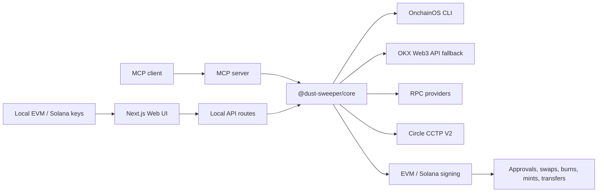

<div align="center">
  
  <h1>Dust Sweeper</h1>
  <p><strong>Consolidate cross-chain dust into native USDC.</strong></p>
  <p>
    Local-first · Non-custodial · OKX DEX / OnchainOS · Circle CCTP V2 · EVM + Solana
  </p>
  <p>
    <a href="#english">English</a> ·
    <a href="#中文">中文</a> ·
    <a href="#codebase">Codebase</a> ·
    <a href="#quick-start">Quick Start</a>
  </p>
  <p>
    
    
    
    
  </p>
</div>


## Table Of Contents

- [English](#english)
  - [What It Is](#what-it-is)
  - [Product Screenshot](#product-screenshot)
  - [Capability Matrix](#capability-matrix)
  - [Supported Chains](#supported-chains)
  - [How The Sweep Works](#how-the-sweep-works)
  - [Codebase](#codebase)
  - [Architecture](#architecture)
  - [Quick Start](#quick-start)
  - [OnchainOS CLI Setup](#onchainos-cli-setup)
  - [Environment](#environment)
  - [Commands](#commands)
  - [MCP Server](#mcp-server)
  - [Security Model](#security-model)
  - [Known Limitations](#known-limitations)
- [中文](#中文)
  - [这是什么](#这是什么)
  - [功能矩阵](#功能矩阵)
  - [支持范围](#支持范围)
  - [工作流程](#工作流程)
  - [代码结构](#代码结构)
  - [本地启动](#本地启动)
  - [OnchainOS CLI 安装](#onchainos-cli-安装)
  - [环境变量](#环境变量)
  - [安全模型](#安全模型)
  - [已知限制](#已知限制)
- [License](#license)

---

## English

### What It Is

Dust Sweeper is a local, non-custodial app for cleaning up small token balances.
It scans configured EVM and Solana wallets, sorts holdings by USD value, routes
eligible assets through OKX DEX / OnchainOS into native USDC, then delivers USDC
to the target chain with Circle CCTP V2.

It is built for users who have many small balances across chains and want one
clear destination balance instead of scattered dust.

### Product Screenshot


### Capability Matrix

| Area | What Dust Sweeper Supports |
|---|---|
| Wallets | Multiple EVM private keys and multiple Solana secret keys |
| Data source | OnchainOS CLI primary, optional OKX Web3 API fallback |
| Scan | Portfolio scan, native USDC scan, USD-value sorting, low-value filtering |
| Eligibility | Separates swappable, CCTP-only, unsupported, no-route, and uneconomic assets |
| Swap | OKX DEX / OnchainOS quotes, approvals, swap transaction generation, Solana swap flow |
| Bridge | Circle CCTP V2 burn, attestation polling, destination receive/mint |
| Destination | Per-wallet delivery or one unified recipient |
| Execution | Parallel chain execution, partial completion, retryable failures, raw tx hashes |
| UI | Local Next.js app, Settings vault, history, language switcher, live progress |
| Agent use | MCP server exposing scan, plan, execute, and chain support tools |

### Supported Chains

| Capability | Count | Chains |
|---|---:|---|
| CCTP / native USDC routes | 21 | Ethereum, Arbitrum, Base, Polygon, Optimism, Avalanche, Unichain, Linea, Sonic, Monad, Codex, Edge, HyperEVM, Ink, Morph, Pharos, Plume, Sei, World Chain, XDC, Solana |
| Full dust swap routes | 10 | Ethereum, Arbitrum, Base, Polygon, Optimism, Avalanche, Linea, Sonic, Monad, Solana |

CCTP-only chains can still move native USDC when Circle CCTP V2 supports both
source and destination. Arbitrary-token dust swaps also require OKX DEX /
OnchainOS portfolio and quote support on that source chain.

### How The Sweep Works

| Step | Stage | Result |
|---:|---|---|
| 1 | Scan wallets | Reads EVM and Solana balances from configured local signers |
| 2 | Classify holdings | Sorts by USD value and folds unavailable or uneconomic rows |
| 3 | Plan routes | Builds per-owner, per-chain swap and CCTP plans |
| 4 | Review | Shows estimated input, output, impact, fees, route kind, and destination |
| 5 | Execute | Runs approvals, swaps, burns, attestations, mints, and local transfers |
| 6 | Inspect | Separates delivered, failed, skipped, and retryable routes |

### Codebase

```text
dust-sweeper/
├─ packages/
│  ├─ core/                 TypeScript sweep engine
│  │  ├─ src/chains/        Chain registry, tokens, RPC resolution
│  │  ├─ src/okx/           OKX API and OnchainOS CLI adapters
│  │  ├─ src/cctp/          Circle CCTP V2 EVM and Solana flows
│  │  ├─ src/signing/       Local signer loading and wallet clients
│  │  ├─ src/scan.ts        Portfolio and native USDC scan logic
│  │  ├─ src/plan.ts        Route planner and output estimation
│  │  └─ src/execute.ts     Live execution and progress events
│  ├─ web/                  Next.js local app
│  │  ├─ app/               UI, API routes, SSE run endpoint
│  │  └─ public/            Logo and static assets
│  └─ mcp/                  stdio MCP server
├─ skills/dust-sweeper/     Agent skill wrapper
├─ docs/assets/             README poster, screenshot, architecture assets
├─ scripts/                 Local helper scripts
├─ .env.example             Safe environment template
└─ pnpm-workspace.yaml      Monorepo workspace
```

| Package | Responsibility |
|---|---|
| `@dust-sweeper/core` | Shared engine for scan, filtering, planning, OKX, CCTP, signing, execution, and tests |
| `web` | Next.js UI and local API layer that calls the core package |
| `@dust-sweeper/mcp` | MCP bridge for agent clients that need the same scan, plan, and execute capabilities |
| `skills/dust-sweeper` | Thin skill entrypoint for Codex / Claude-style agent workflows |

### Architecture



The web app and MCP server share the same core package, so planning and live
execution behavior stay consistent across UI and agent workflows.

### Quick Start

```bash
pnpm install
cp .env.example .env
pnpm build
pnpm dev:web
```

Open the local app:

```text
http://localhost:3000
```

If your environment refuses `localhost`, use:

```text
http://127.0.0.1:3000
```

### OnchainOS CLI Setup

Live mode needs an authenticated `onchainos` CLI for portfolio data, quotes,
approvals, and swap transaction generation. Demo mode does not need it.

Recommended install:

```bash
npx skills add okx/onchainos-skills
```

Direct CLI install on macOS / Linux:

```bash
curl -sSL https://raw.githubusercontent.com/okx/onchainos-skills/main/install.sh | sh
```

Direct CLI install on Windows PowerShell:

```powershell
irm https://raw.githubusercontent.com/okx/onchainos-skills/main/install.ps1 | iex
```

Verify the binary is available:

```bash
onchainos --version
```

If the binary was installed to `~/.local/bin` but your shell cannot find it,
add this to your shell profile:

```bash
export PATH="$HOME/.local/bin:$PATH"
```

Optional fallback: if you do not install OnchainOS, configure your own OKX Web3
API credentials in `.env`. OnchainOS is still the recommended live data source.

### Environment

Fill only the variables you need. Keep real values in `.env`; never commit them.

```bash
# EVM signing
PRIVATE_KEY_EVM=
PRIVATE_KEYS_EVM=

# Solana signing
PRIVATE_KEY_SOL=
PRIVATE_KEYS_SOL=

# Optional OKX fallback credentials
OKX_API_KEY=
OKX_SECRET_KEY=
OKX_PASSPHRASE=
OKX_PROJECT_ID=

# Optional proxy for OKX Web3 API calls
OKX_PROXY_URL=

# Optional RPC strategy
ALCHEMY_API_KEY=
RPC_BASE=
RPC_ARBITRUM=
RPC_SOLANA=
```

See [.env.example](.env.example) for the full template.

### Commands

| Command | Purpose |
|---|---|
| `pnpm dev:web` | Start the local Next.js app on port 3000 |
| `pnpm build` | Build all workspace packages |
| `pnpm test` | Run workspace tests |
| `pnpm --filter @dust-sweeper/core test` | Run core unit tests |
| `pnpm --filter web build` | Build the web app |
| `pnpm --filter @dust-sweeper/mcp build` | Build the MCP server |
| `pnpm proxy:okx` | Start the optional local OKX proxy helper |

### MCP Server

Build the shared core and MCP package:

```bash
pnpm --filter @dust-sweeper/core build
pnpm --filter @dust-sweeper/mcp build
```

Register it with a stdio MCP client:

```bash
claude mcp add dust-sweeper -- node "$(pwd)/packages/mcp/dist/index.js"
```

Available tools:

| Tool | Purpose |
|---|---|
| `scan_dust` | Scan configured wallets and return eligible holdings |
| `plan_sweep` | Build a route plan without executing |
| `execute_sweep` | Execute a reviewed sweep plan |
| `get_supported_chains` | Return chain and route support metadata |

### Security Model

- No hosted backend is required.
- Real private keys, OKX credentials, proxy credentials, and RPC keys belong in `.env` or the local browser vault.
- `.env`, `.env.*`, build output, logs, and common secret files are ignored by git.
- Browser-imported keys are stored in localStorage and are sent only to local Next.js API routes.
- Use dedicated sweep wallets, keep enough native gas on each source chain, and test with small balances before moving meaningful funds.

### Known Limitations

- Arbitrary-token dust swaps require OKX DEX / OnchainOS route support.
- CCTP-only chains can move native USDC but may not support arbitrary-token portfolio scans or swaps.
- Mainnet execution depends on live RPCs, wallet gas, OKX / OnchainOS availability, Circle attestation availability, and destination-chain gas for receive/mint.
- Browser localStorage is convenient for local testing but is not a hardware-wallet security boundary.

---

## 中文

### 这是什么

Dust Sweeper 是一个本地运行、非托管的小额资产归集工具。它会扫描配置好的
EVM 和 Solana 钱包，把可处理的小额资产通过 OKX DEX / OnchainOS 换成原生
USDC，再用 Circle CCTP V2 把 USDC 送到目标链。

适合的场景很简单：多个链、多个钱包里散着小额资产，想把它们整理成一个更
清楚的 USDC 余额。

### 功能矩阵

| 模块 | 支持内容 |
|---|---|
| 钱包 | 多个 EVM 私钥、多个 Solana secret key |
| 数据源 | OnchainOS CLI 优先，OKX Web3 API 可作为可选 fallback |
| 扫描 | 组合钱包扫描、原生 USDC 扫描、按美元价值排序、低价值过滤 |
| 资产分类 | 可 swap、仅 CCTP、无路由、不支持、不划算的资产分开展示 |
| Swap | OKX DEX / OnchainOS 报价、授权、交易生成、Solana swap 流程 |
| 跨链 | Circle CCTP V2 burn、attestation 轮询、目标链 receive/mint |
| 收款 | 每个钱包原路收款，或统一收款到一个地址 |
| 执行 | 多链并行、部分完成、失败可重试、跳过原因、原始 tx hash |
| UI | 本地 Next.js 界面、Settings 密钥管理、History、语言切换、实时进度 |
| Agent | MCP server 提供 scan、plan、execute、supported chains 工具 |

### 支持范围

| 能力 | 数量 | 链 |
|---|---:|---|
| CCTP / 原生 USDC 跨链 | 21 | Ethereum, Arbitrum, Base, Polygon, Optimism, Avalanche, Unichain, Linea, Sonic, Monad, Codex, Edge, HyperEVM, Ink, Morph, Pharos, Plume, Sei, World Chain, XDC, Solana |
| 完整 dust swap 路线 | 10 | Ethereum, Arbitrum, Base, Polygon, Optimism, Avalanche, Linea, Sonic, Monad, Solana |

只支持 CCTP 的链仍然可以处理原生 USDC 转移。任意代币 dust swap 还依赖
OKX DEX / OnchainOS 在该源链上的 portfolio 和 quote 支持。

### 工作流程

| 步骤 | 阶段 | 结果 |
|---:|---|---|
| 1 | 扫描钱包 | 读取本地 EVM / Solana 钱包余额 |
| 2 | 分类资产 | 按美元价值排序，折叠不可处理或不划算资产 |
| 3 | 生成路线 | 按 owner 和 chain 生成 swap / CCTP plan |
| 4 | 用户确认 | 展示输入、预计输出、损耗、费用、路线类型和目标链 |
| 5 | 执行交易 | 执行 approve、swap、burn、attestation、mint、transfer |
| 6 | 查看结果 | 区分成功到账、失败、跳过、可重试路线和 tx hash |

### 代码结构

```text
dust-sweeper/
├─ packages/
│  ├─ core/                 核心 TypeScript 引擎
│  │  ├─ src/chains/        链配置、代币配置、RPC 选择
│  │  ├─ src/okx/           OKX API 和 OnchainOS CLI 适配
│  │  ├─ src/cctp/          Circle CCTP V2 EVM / Solana 流程
│  │  ├─ src/signing/       本地 signer 和 wallet client
│  │  ├─ src/scan.ts        资产扫描和原生 USDC 扫描
│  │  ├─ src/plan.ts        路线规划和输出估算
│  │  └─ src/execute.ts     实盘执行和进度事件
│  ├─ web/                  本地 Next.js 应用
│  │  ├─ app/               UI、API routes、SSE 执行进度
│  │  └─ public/            logo 和静态资源
│  └─ mcp/                  stdio MCP server
├─ skills/dust-sweeper/     Agent skill 入口
├─ docs/assets/             README 海报、产品截图、架构图
├─ scripts/                 本地辅助脚本
├─ .env.example             安全的环境变量模板
└─ pnpm-workspace.yaml      Monorepo workspace
```

| 包 | 职责 |
|---|---|
| `@dust-sweeper/core` | 扫描、过滤、规划、OKX、CCTP、签名、执行和测试 |
| `web` | 本地 UI 和 API 层，调用 core 包 |
| `@dust-sweeper/mcp` | 给 MCP client / agent 使用的同一套能力 |
| `skills/dust-sweeper` | 给 Codex / Claude 类 agent 使用的轻量 skill 入口 |

### 本地启动

```bash
pnpm install
cp .env.example .env
pnpm build
pnpm dev:web
```

打开：

```text
http://localhost:3000
```

如果本机环境拒绝 `localhost`，用：

```text
http://127.0.0.1:3000
```

### OnchainOS CLI 安装

Live 实盘模式需要本地已安装并可运行的 `onchainos` CLI，用来获取 portfolio、
quote、approve 和 swap 交易数据。Demo 模式不需要安装。

推荐安装方式：

```bash
npx skills add okx/onchainos-skills
```

macOS / Linux 直接安装 CLI：

```bash
curl -sSL https://raw.githubusercontent.com/okx/onchainos-skills/main/install.sh | sh
```

Windows PowerShell 直接安装 CLI：

```powershell
irm https://raw.githubusercontent.com/okx/onchainos-skills/main/install.ps1 | iex
```

检查是否安装成功：

```bash
onchainos --version
```

如果安装到了 `~/.local/bin` 但终端找不到命令，把下面这行加到 shell profile：

```bash
export PATH="$HOME/.local/bin:$PATH"
```

可选 fallback：如果不安装 OnchainOS，也可以在 `.env` 配置自己的 OKX Web3
API 凭证。不过 Live 模式仍然推荐优先使用 OnchainOS。

### 环境变量

真实值只放在 `.env`，不要写进代码，不要提交到 GitHub。

```bash
PRIVATE_KEY_EVM=
PRIVATE_KEYS_EVM=
PRIVATE_KEY_SOL=
PRIVATE_KEYS_SOL=

OKX_API_KEY=
OKX_SECRET_KEY=
OKX_PASSPHRASE=
OKX_PROJECT_ID=

ALCHEMY_API_KEY=
RPC_BASE=
RPC_ARBITRUM=
RPC_SOLANA=
```

完整模板见 [.env.example](.env.example)。

### 安全模型

- 不需要托管后端。
- 私钥、OKX key、代理配置、RPC key 都只应该存在本地 `.env` 或浏览器本地 vault。
- `.env`、`.env.*`、构建产物、日志和常见 secret 文件都已被 git ignore。
- 浏览器导入的 key 保存在 localStorage，只发送给本地 Next.js API routes。
- 建议使用专门的小额清扫钱包，并先用少量资产测试主网执行。

### 已知限制

- 任意代币 dust swap 依赖 OKX DEX / OnchainOS 路由支持。
- CCTP-only 链可以移动原生 USDC，但不一定支持任意代币扫描和 swap。
- 主网执行依赖 RPC、钱包 gas、OKX / OnchainOS、Circle attestation、目标链 mint gas。
- 浏览器 localStorage 只是本地方便方案，不等于硬件钱包安全边界。

## License

MIT
