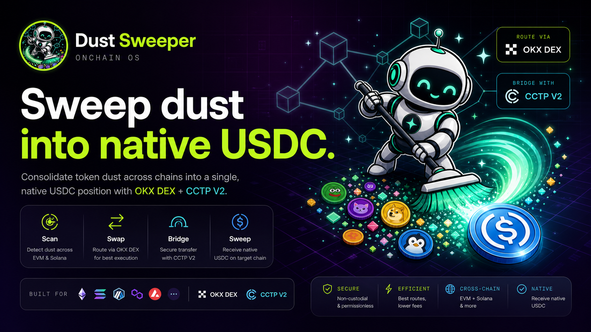
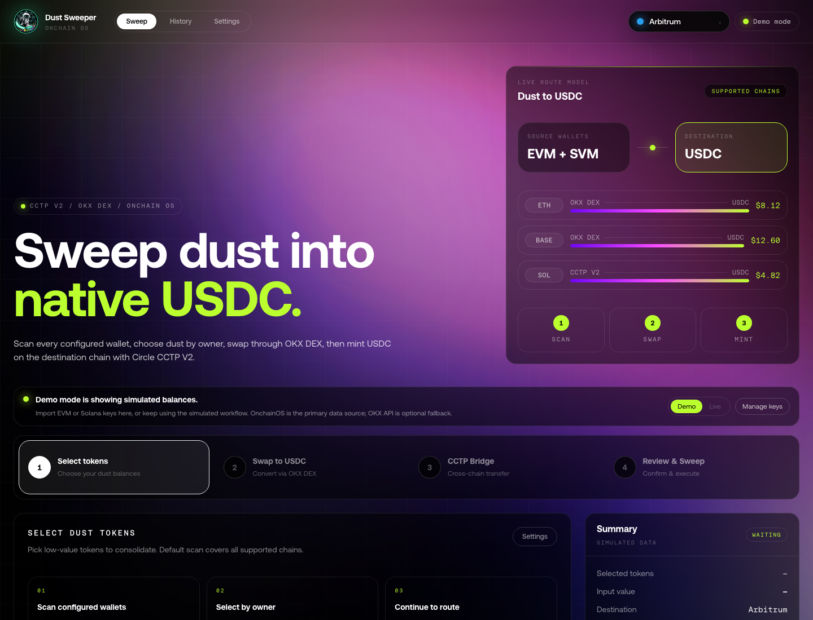

# Dust Sweeper



> One click. All dust. One native USDC position.

Dust Sweeper is a local, non-custodial dust-consolidation app. It scans small
token balances across supported EVM chains and Solana, routes eligible swaps to
native USDC through OKX DEX / OnchainOS, then moves USDC to a destination chain
with Circle CCTP V2.



## What It Does

- Scans multiple local EVM and Solana wallets.
- Sorts holdings by USD value and separates unavailable or uneconomic assets.
- Swaps eligible token dust into native USDC through OKX DEX / OnchainOS.
- Bridges native USDC with Circle CCTP V2 where both source and destination are supported.
- Supports per-wallet delivery or one unified recipient.
- Tracks success, partial delivery, skipped routes, raw tx hashes, and retryable errors.
- Runs fully locally through a Next.js UI, with an optional MCP server for agent workflows.
- Supports English and Chinese UI, selectable from Settings.

## Supported Routes

### CCTP / Native USDC

The app models CCTP-native USDC movement across 21 chains:

Ethereum, Arbitrum, Base, Polygon, Optimism, Avalanche, Unichain, Linea, Sonic,
Monad, Codex, Edge, HyperEVM, Ink, Morph, Pharos, Plume, Sei, World Chain, XDC,
and Solana.

### Dust Swap + CCTP

Arbitrary-token dust swaps depend on OKX DEX / OnchainOS portfolio and quote
availability. Current full sweep coverage is focused on:

Ethereum, Arbitrum, Base, Polygon, Optimism, Avalanche, Linea, Sonic, Monad,
and Solana.

CCTP-only chains can still transfer native USDC, even when arbitrary-token dust
swaps are not available there yet.

## Architecture

| Package | Purpose |
|---|---|
| `packages/core` | TypeScript engine for chain config, scan, filtering, planning, execution, OKX, CCTP, signing, and tests |
| `packages/web` | Next.js 14 local web UI with scan, plan, execute, settings, history, language switching, and SSE progress |
| `packages/mcp` | stdio MCP server exposing `scan_dust`, `plan_sweep`, `execute_sweep`, and `get_supported_chains` |
| `skills/dust-sweeper` | Claude/Codex skill entry for agent-driven dust sweep workflows |

## Security Model

- No hosted backend is required.
- Private keys are never committed and should stay in `.env` or the browser local vault.
- Browser-imported keys are stored in localStorage and sent only to local Next.js API routes.
- `.env` and local override files are ignored by git.
- OKX API credentials and proxy credentials are optional local fallbacks.
- Use dedicated sweep wallets and test with small balances first.

## Prerequisites

- Node.js 20+
- pnpm 9+
- OnchainOS CLI authenticated locally for primary live portfolio / quote / swap data
- Optional OKX Web3 API credentials as direct fallback
- Optional Alchemy API key or per-chain RPC URLs
- EVM or Solana wallets with enough native gas for approvals, swaps, transfers, and CCTP receive/mint transactions

## Quick Start

```bash
pnpm install
cp .env.example .env
pnpm build
pnpm dev:web
```

Open:

```text
http://localhost:3000
```

If your local browser has trouble resolving `localhost`, use:

```text
http://127.0.0.1:3000
```

## Environment

Fill only what you need in `.env`.

```bash
# EVM signing
PRIVATE_KEY_EVM=
PRIVATE_KEYS_EVM=

# Solana signing
PRIVATE_KEY_SOL=
PRIVATE_KEYS_SOL=

# Optional OKX fallback credentials
OKX_API_KEY=
OKX_SECRET_KEY=
OKX_PASSPHRASE=
OKX_PROJECT_ID=

# Optional RPC
ALCHEMY_API_KEY=
RPC_BASE=
RPC_ARBITRUM=
```

See [.env.example](.env.example) for the full list.

## Web Flow

1. Import local keys or stay in demo mode.
2. Pick destination chain.
3. Scan balances.
4. Select eligible dust rows.
5. Choose per-wallet delivery or one recipient.
6. Choose destination payer for CCTP receive/mint when needed.
7. Review OKX swap output and CCTP bridge plan.
8. Execute and watch per-route progress.
9. Review successful deliveries, failed routes, skipped routes, and raw tx hashes.

## MCP Server

Build first:

```bash
pnpm --filter @dust-sweeper/core build
pnpm --filter @dust-sweeper/mcp build
```

Register with Claude Desktop or any stdio MCP client:

```bash
claude mcp add dust-sweeper -- node "$(pwd)/packages/mcp/dist/index.js"
```

Available tools:

- `scan_dust`
- `plan_sweep`
- `execute_sweep`
- `get_supported_chains`

## Development

```bash
pnpm --filter @dust-sweeper/core test
pnpm --filter @dust-sweeper/core build
pnpm --filter @dust-sweeper/mcp build
pnpm --filter web build
```

Run the optional local OKX proxy:

```bash
pnpm proxy:okx
```

## Known Limitations

- Arbitrary-token dust swaps require OKX DEX / OnchainOS quote support.
- CCTP-only chains can move native USDC but do not yet support arbitrary-token dust swaps.
- Mainnet execution depends on live RPCs, wallet gas, OKX / OnchainOS availability, and Circle attestation availability.
- Browser localStorage is convenient but is not a hardware-wallet security boundary.

## 中文说明

Dust Sweeper 是一个本地运行、非托管的小额资产归集工具。它会扫描多个
EVM / Solana 钱包里的小额资产，通过 OKX DEX / OnchainOS 换成原生 USDC，
再用 Circle CCTP V2 把 USDC 铸造到目标链。

### 核心功能

- 多钱包资产扫描。
- 按美元价值排序展示持仓。
- 自动折叠无 OKX 路由、不支持跨链、或不划算的资产。
- 支持小额模式和全部可用资产模式。
- 支持原生 gas、稳定币、包装原生币的可选清扫。
- 支持每个钱包各自接收，或统一接收到一个地址。
- 支持 EVM 和 Solana 目标链付款方配置。
- 执行过程中区分成功、失败、部分到账、跳过和可重试错误。
- Settings 里支持 English / 中文切换。
- 本地 Next.js UI 和 MCP server 复用同一个 TypeScript core。

### 快速开始

```bash
pnpm install
cp .env.example .env
pnpm build
pnpm dev:web
```

打开：

```text
http://localhost:3000
```

### 安全注意

- 不要提交 `.env`。
- 不要把真实私钥、OKX key、Alchemy key 写进代码。
- 建议使用专门的小额清扫钱包。
- 第一次主网执行请先用少量资产测试。

## License

MIT
